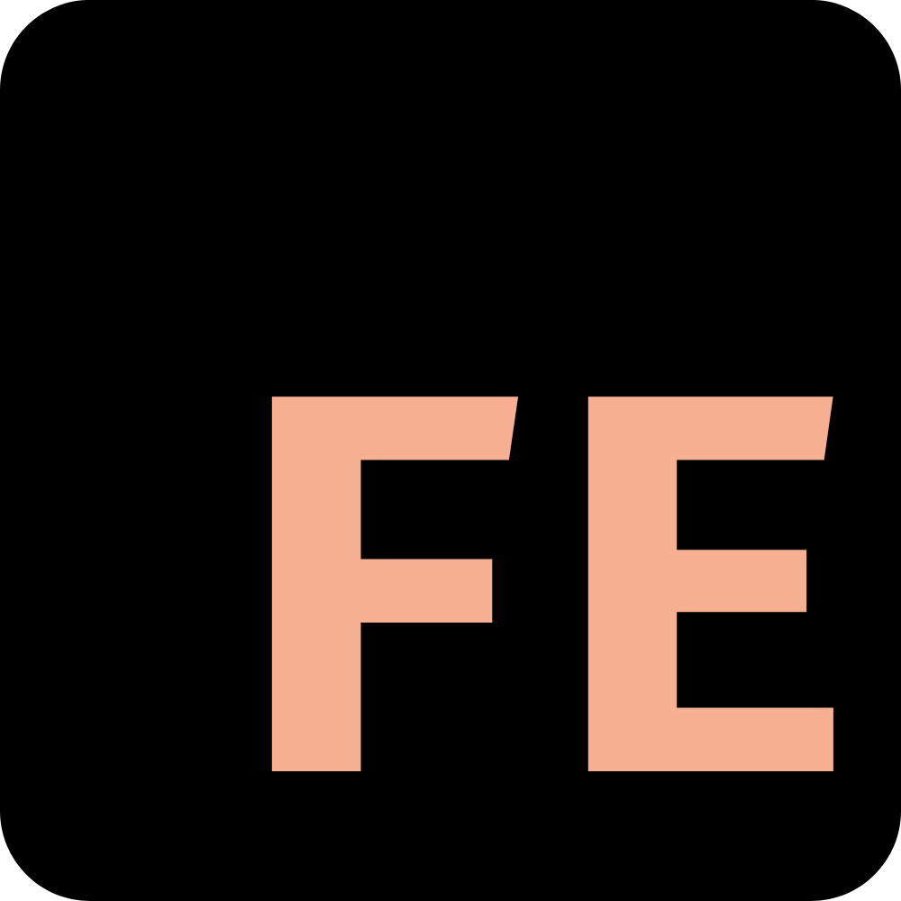

    

<h2 align="center">Feno</h2>

Feno is an MIT-licensed open source project. If you'd like to join to the backers team, please consider:

- [Become a backer or sponsor on Patreon](https://www.patreon.com/yahirgnz).
- [One-time donation via PayPal](https://paypal.me/yahirgnz).

---

## Introduction

Feno is a frontend programming language that offers a complete package of new tools to improve the development of static websites. We design each part of Feno in detail focusing on improving the experience of each programmer and at the same time Feno becomes a powerful language by having different functionalities such as: Components, Layouts, Global Storage and at the same time offers tools never seen before. : Meta files, Modules, Cubes and more. All this makes Feno one of the best options to use.

### Browser compatibility

Feno supports all browsers that are [ES5-compliant](http://kangax.github.io/compat-table/es5/) (IE8 and below are not supported).

## Ecosystem

| Project | Description |
|---------|--------|
| [feno-cli] | Installation center and tools for feno |
| [feno-web] | Official website |

[feno-cli]: https://github.com/fenolang/feno-cli
[feno-web]: https://github.com/fenolang/feno-web

## Documentation

You can learn all about Feno in our official documentation in: [Fenolang Website](https://fenolang.herokuapp.com)

## Issues

Soon we will open a place on our site so you can freely report errors

## Changelog

You can check the changelog in [our site](https://fenolang.herokuapp.com) or here [in github](https://github.com/fenolang/feno/blob/master/CHANGELOG.md)

## Stay in touch

- [Twitter](https://twitter.com/fenolang)
- [Blog](https://medium.com/@fenolang)

## Thanks

Welcome and thanks for being here :')

## License

[MIT](http://opensource.org/licenses/MIT)

Copyright (c) 2019-present, Yahir Gomez (YahirGNz)